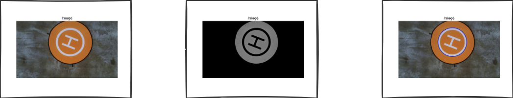

# Helipad

This is a simple program, made in Python, to detect and track a helipad. 

## How to execute
- Install poetry (optional)
```
pip install poetry
```

- install dependencies and active virtual environment:
```
poetry install
poetry shell
```
- run the example
```
python3 main.py
```

## Description

